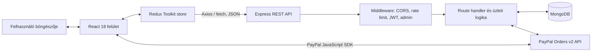
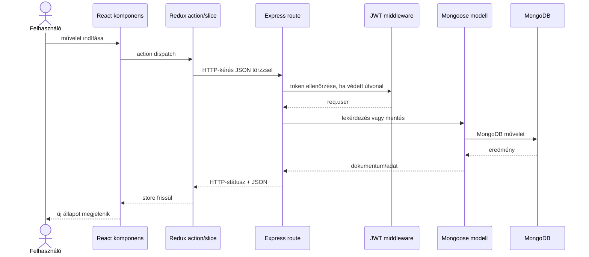
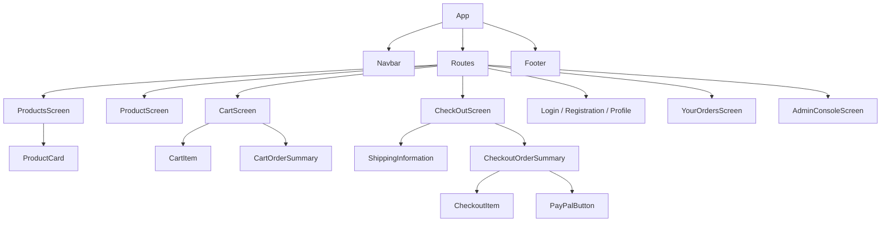
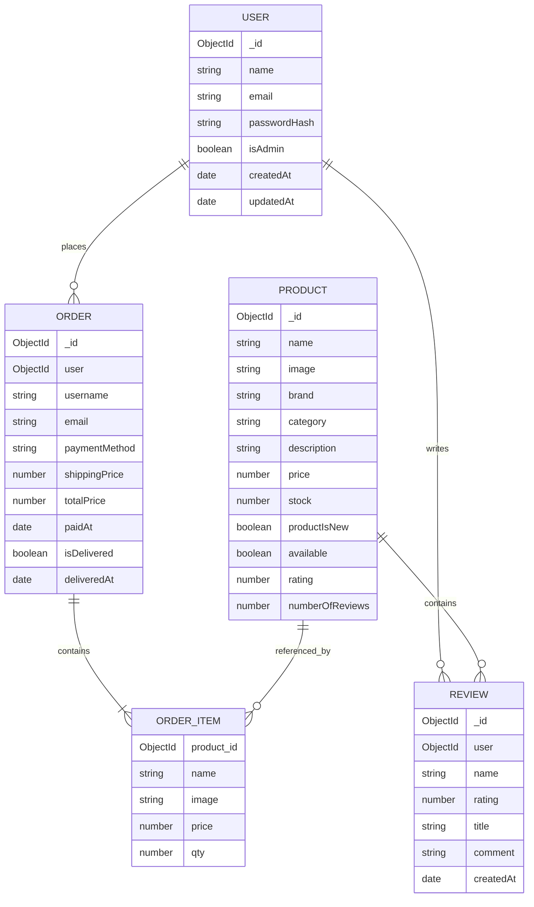
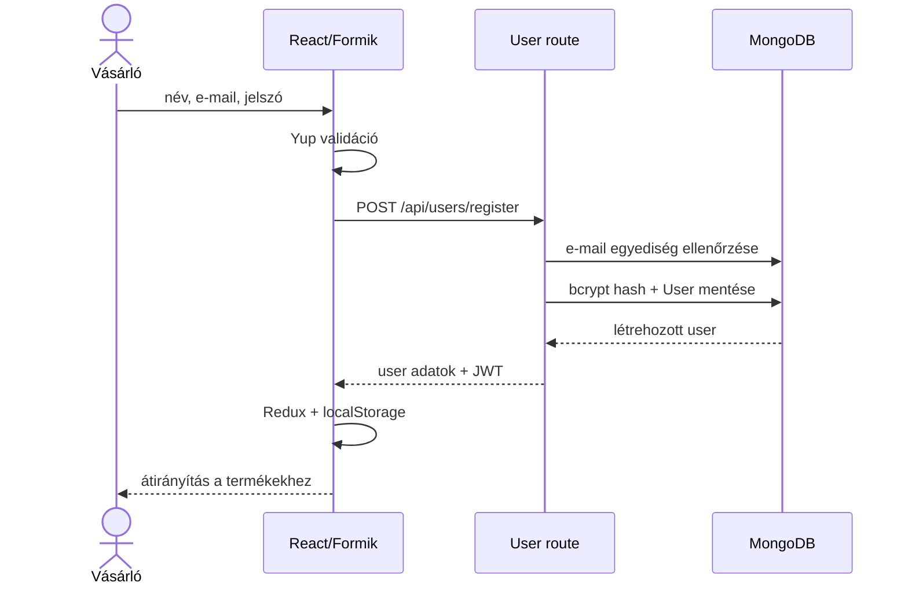
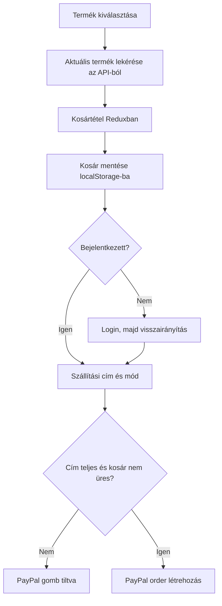
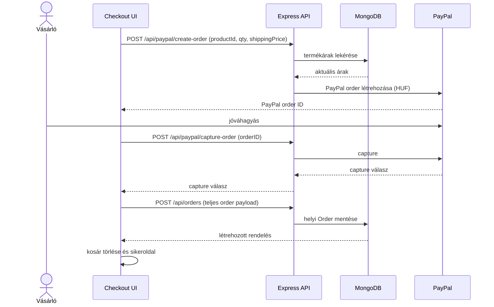
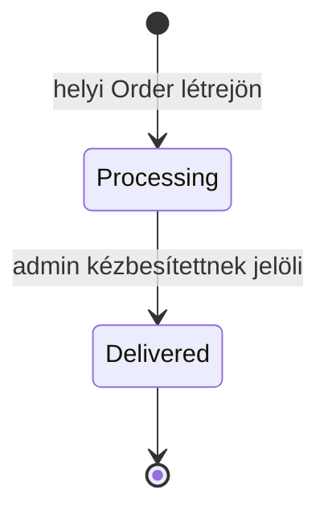
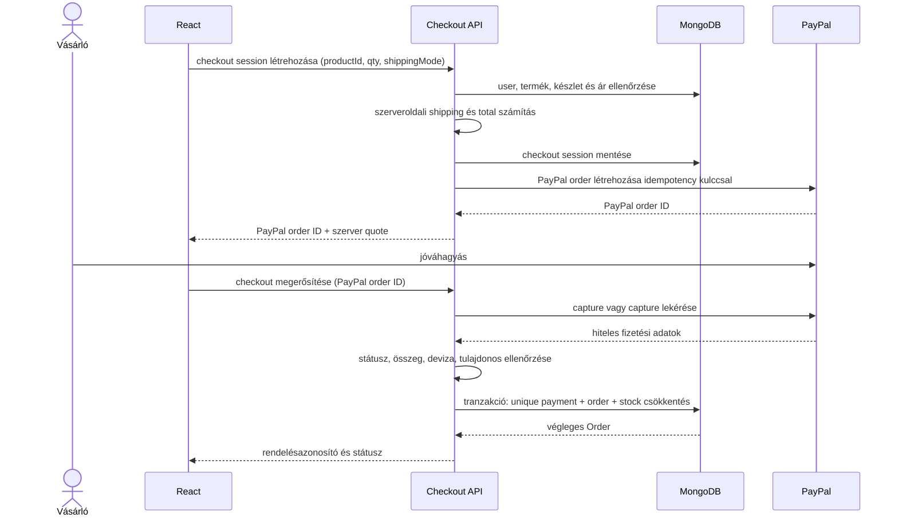

# 3D Garage – technológiai, architekturális és üzleti dokumentáció

> A dokumentum célja, hogy két fejlesztő gyorsan és közös rendszerképpel tudja folytatni a projektet. A leírás a repository 2026. augusztus 16-i állapotát tükrözi. Ahol a jelenlegi implementáció és a kívánatos üzleti működés eltér, azt külön **Jelenlegi állapot** és **Javasolt célállapot** megjegyzés jelzi.

## Tartalom

1. [A rendszer célja](#1-a-rendszer-célja)
2. [Fő funkciók és szerepkörök](#2-fő-funkciók-és-szerepkörök)
3. [Technológiai stack](#3-technológiai-stack)
4. [Magas szintű architektúra](#4-magas-szintű-architektúra)
5. [Repository- és mappaszerkezet](#5-repository--és-mappaszerkezet)
6. [Frontend architektúra](#6-frontend-architektúra)
7. [Backend architektúra](#7-backend-architektúra)
8. [Adatmodell](#8-adatmodell)
9. [API-felület](#9-api-felület)
10. [Üzleti logika](#10-üzleti-logika)
11. [Fő működési folyamatok](#11-fő-működési-folyamatok)
12. [Hitelesítés és jogosultságkezelés](#12-hitelesítés-és-jogosultságkezelés)
13. [Hibakezelés és alapvető védelem](#13-hibakezelés-és-alapvető-védelem)
14. [Konfiguráció és környezeti változók](#14-konfiguráció-és-környezeti-változók)
15. [Tesztelés](#15-tesztelés)
16. [Ismert eltérések, kockázatok és technikai adósság](#16-ismert-eltérések-kockázatok-és-technikai-adósság)
17. [Javasolt célarchitektúra](#17-javasolt-célarchitektúra)
18. [Fejlesztői indulási útmutató](#18-fejlesztői-indulási-útmutató)
19. [Közös fejlesztési szabályok](#19-közös-fejlesztési-szabályok)
20. [Fogalomtár](#20-fogalomtár)

---

## 1. A rendszer célja

A **3D Garage** egy teljes stackes webáruház 3D nyomtatott termékek értékesítésére. A vásárló megtekintheti a termékkatalógust, kosárba helyezheti a termékeket, regisztrálhat, megadhatja a szállítási címet, PayPalon keresztül fizethet, értékelést írhat, valamint visszanézheti a rendeléseit. Az adminisztrátor külön kezelőfelületen menedzselheti a felhasználókat, termékeket, értékeléseket és rendeléseket.

A rendszer három fő futási egységből áll:

- React-alapú böngészős kliens;
- Express-alapú REST API;
- MongoDB adatbázis.

A PayPal külső szolgáltatásként vesz részt a fizetési folyamatban.

### 1.1 Jelenlegi hatókör

A projekt jelenleg az alábbi webshopfolyamatokat valósítja meg:

- nyilvános terméklista és termékadatlap;
- helyi, böngészőben megőrzött kosár;
- regisztráció, bejelentkezés és profilfrissítés;
- standard vagy expressz szállítás választása;
- PayPal-rendelés létrehozása és capture művelet;
- helyi rendelés mentése;
- vásárlói rendeléstörténet;
- termékértékelések;
- adminisztrációs CRUD műveletek;
- reszponzív, világos és sötét megjelenés.

### 1.2 Ami még nincs teljes körűen megvalósítva

- készlet biztonságos, tranzakciós csökkentése rendeléskor;
- PayPal capture és helyi rendelés atomi összekapcsolása;
- e-mailes visszaigazolás és számlázás;
- elfelejtett jelszó és e-mail-cím ellenőrzés;
- kuponok, kedvezmények és adószámítás;
- rendelésrészletező oldal és professzionális nyomtatási nézet;
- termékképek saját feltöltése és tárolása;
- éles üzemeltetési megfigyelés, naplózás és skálázható rate limiting.

---

## 2. Fő funkciók és szerepkörök

### 2.1 Vendég

A be nem jelentkezett látogató:

- megnyithatja a kezdőlapot;
- böngészheti az elérhető termékeket;
- megnyithatja a termékadatlapot;
- kosárba tehet terméket;
- módosíthatja vagy törölheti a kosár tartalmát;
- regisztrálhat és bejelentkezhet.

A vendég nem tud fizetni, értékelést írni, profilt vagy rendeléstörténetet megnyitni. A checkout képernyő bejelentkezés nélkül a login oldalra irányít.

### 2.2 Bejelentkezett vásárló

A vásárló a vendég funkcióin felül:

- szerkesztheti saját profilját;
- megadhat szállítási címet;
- szállítási módot választhat;
- PayPal-fizetést indíthat;
- megtekintheti saját rendeléseit;
- termékenként egy értékelést írhat.

### 2.3 Adminisztrátor

Az adminisztrátor `isAdmin: true` mezővel rendelkező felhasználó. A vásárlói funkciókon felül:

- listázhatja és törölheti a felhasználókat;
- létrehozhat, módosíthat és törölhet termékeket;
- törölhet termékértékeléseket;
- listázhatja és törölheti az összes rendelést;
- kézbesítettnek jelölhet egy rendelést.

Az adminisztrátor saját adminfiókját az adminfelületről nem törölheti.

---

## 3. Technológiai stack

### 3.1 Futtatási környezet és nyelv

| Terület | Technológia | Projektben deklarált verzió | Szerep |
|---|---|---:|---|
| Nyelv | JavaScript / JSX | ECMAScript modules a szerveren | Kliens- és szerveroldali fejlesztés |
| Backend runtime | Node.js | nincs rögzítve; a natív `fetch` miatt legalább Node 18 javasolt | Express API és PayPal REST-hívások futtatása |
| Csomagkezelő | npm | lock fájlokkal | Függőségek és scriptek kezelése |
| Adatcsere | JSON over HTTP | REST jellegű API | Böngésző–szerver kommunikáció |

> A Node-verzió jelenleg nincs `engines`, `.nvmrc` vagy hasonló fájlban rögzítve. A `server/services/paypalService.js` globális `fetch` API-t használ, ezért a csapat számára célszerű Node 18 vagy újabb LTS-verziót szabványosítani.

### 3.2 Frontend technológiák

| Technológia | Verzió | Feladat |
|---|---:|---|
| React | `^18.2.0` | Komponensalapú felhasználói felület |
| React DOM | `^18.2.0` | React alkalmazás böngészős renderelése |
| Create React App / react-scripts | `5.0.1` | Build, fejlesztői szerver és kliens tesztkörnyezet |
| CRACO | `^7.1.0` | CRA-konfiguráció módosítása eject nélkül |
| React Router DOM | `^6.10.0` | Kliensoldali útvonalkezelés |
| Redux Toolkit | `^1.9.5` | Globális kliensállapot és reducer logika |
| React Redux | `^8.0.5` | React–Redux integráció |
| Axios | `^1.3.6` | REST API-hívások a Redux actionökből |
| Chakra UI | `^2.5.5` | Reszponzív komponensek, témázás, dark mode |
| Emotion | `^11.10.6` | Chakra UI CSS-in-JS alapja |
| Framer Motion | `^10.12.4` | Chakra animációs függősége és mozgások |
| React Icons | `^4.8.0` | Ikonkészlet |
| Formik | `^2.2.9` | Bejelentkezési, regisztrációs és profilűrlapok állapota |
| Yup | `^1.1.1` | Kliensoldali űrlapvalidáció |
| PayPal React SDK | `^7.8.3` | PayPal JavaScript SDK és fizetési gombok |
| Testing Library | több csomag | React komponens- és felhasználói tesztek alapja |
| Web Vitals | `^2.1.4` | Böngészős teljesítménymérési lehetőség |

### 3.3 Backend technológiák

| Technológia | Verzió | Feladat |
|---|---:|---|
| Express | `^4.18.2` | HTTP-szerver, middleware pipeline és API routing |
| Mongoose | `^7.0.4` | MongoDB objektummodellezés, sémák és lekérdezések |
| MongoDB | külső szolgáltatás | Felhasználók, termékek és rendelések tartós tárolása |
| JSON Web Token | `^9.0.0` | Stateless API-hitelesítés |
| bcryptjs | `^2.4.3` | Jelszavak sózása és hash-elése |
| dotenv | `^16.0.3` | `.env` konfiguráció betöltése |
| express-async-handler | `^1.2.0` | Aszinkron route hibák átadása az Express hibakezelőnek |
| Node test runner | Node beépített modul | Backend unit jellegű tesztek |

### 3.4 Külső rendszerek

| Rendszer | Integráció | Adatirány |
|---|---|---|
| MongoDB | Mongoose kapcsolat a `MONGO_URI` alapján | szerver ↔ adatbázis |
| PayPal Checkout | OAuth 2 token + Orders v2 REST API + PayPal JS SDK | kliens ↔ PayPal, szerver ↔ PayPal |

---

## 4. Magas szintű architektúra

Az alkalmazás klasszikus háromrétegű webes architektúrát követ. A böngésző nem kapcsolódik közvetlenül az adatbázishoz, és a PayPal titkos kulcsát sem ismeri. A kliens csak a nyilvános PayPal client ID-t kapja meg a szervertől.



### 4.1 Rétegek felelőssége

| Réteg | Felelősség | Nem ennek a rétegnek a feladata |
|---|---|---|
| React képernyők és komponensek | megjelenítés, felhasználói interakció, kliensoldali validáció | megbízható ár- vagy jogosultságellenőrzés |
| Redux slice-ok | globális UI-állapot, betöltés/hiba/adat tárolása | adatbázis-művelet |
| Redux actionök | aszinkron API-hívás és state-frissítés koordinálása | biztonsági döntés |
| Express middleware | kérés előfeldolgozása, hitelesítés, jogosultság, limitálás | UI-megjelenítés |
| Route handlerek | bemenet fogadása, domainművelet indítása, HTTP-válasz | tartós UI-állapot |
| Mongoose modellek | séma, validáció, relációk és perzisztencia | böngészős állapot |
| PayPal service | PayPal OAuth és Orders API kommunikáció | helyi rendelés üzleti szabályai |

### 4.2 Általános kéréséletciklus



---

## 5. Repository- és mappaszerkezet

```text
Techlines/
├── client/
│   ├── public/                 # statikus HTML, favicon, manifest
│   ├── src/
│   │   ├── components/         # újrahasznosítható UI és checkout komponensek
│   │   ├── logo/               # 3D Garage logóvariánsok
│   │   ├── redux/
│   │   │   ├── actions/        # aszinkron API-koordináció
│   │   │   ├── slices/         # Redux state és reducerek
│   │   │   └── store.js        # root store
│   │   ├── screens/            # route-szintű oldalak
│   │   ├── App.js              # kliensoldali route-tábla
│   │   └── index.js            # React belépési pont
│   ├── craco.config.js         # fejlesztői szerver felülírása
│   └── package.json            # frontend függőségek és scriptek
├── server/
│   ├── __tests__/              # Node test runner tesztek
│   ├── middleware/             # auth, hibakezelés, rate limit
│   ├── models/                 # User, Product, Order sémák
│   ├── routes/                 # REST végpontok
│   ├── services/               # PayPal REST kliens
│   ├── database.js             # MongoDB kapcsolat
│   └── index.js                # Express alkalmazás belépési pont
├── .env                        # helyi titkok; nem dokumentálandó és nem commitolandó
├── package.json                # backend és közös futtatási scriptek
├── README.md                   # rövid indítási útmutató
├── SECURITY.md                 # biztonsági állapot és teendők
└── ARCHITECTURE.md             # ez a részletes rendszerleírás
```

### 5.1 Fontos belépési pontok

- Frontend: `client/src/index.js` → `client/src/App.js`
- Redux: `client/src/redux/store.js`
- Backend: `server/index.js`
- Adatbázis: `server/database.js`
- PayPal: `client/src/components/PayPalButton.jsx` és `server/services/paypalService.js`

---

## 6. Frontend architektúra

### 6.1 Alkalmazásindítás

Az `index.js` létrehozza a React rootot, és a teljes alkalmazást Redux `Provider` komponensbe csomagolja. Az `App.js` további két globális providert használ:

- `ChakraProvider`: Chakra UI téma és color mode;
- `BrowserRouter`: kliensoldali navigáció.

A `Navbar` és a `Footer` minden route körül megjelenik, a route tartalma a kettő közötti `main` elemben renderelődik.

### 6.2 Kliensoldali route-ok

| Útvonal | Képernyő | Hozzáférés | Feladat |
|---|---|---|---|
| `/` | `LandingScreen` | nyilvános | márka- és kezdőoldal |
| `/products` | `ProductsScreen` | nyilvános | elérhető termékek listája |
| `/product/:id` | `ProductScreen` | nyilvános; értékeléshez login kell | termékadatok, kosárba helyezés, értékelések |
| `/cart` | `CartScreen` | nyilvános | kosártartalom és előzetes összegzés |
| `/login` | `LoginScreen` | nyilvános | bejelentkezés |
| `/registration` | `RegistraionScreen` | nyilvános | regisztráció |
| `/profile` | `ProfileScreen` | bejelentkezett | saját profil szerkesztése |
| `/checkout` | `CheckOutScreen` | bejelentkezett | szállítás és PayPal-fizetés |
| `/your-orders` | `YourOrdersScreen` | bejelentkezett | saját rendelések |
| `/admin-console` | `AdminConsoleScreen` | admin | adminisztráció |
| `/order-success` | `OrderSuccessScreen` | jelenleg nincs route guard | sikeres rendelés visszajelzése |

> A valódi jogosultságot mindig a backendnek kell kikényszerítenie. A React `Navigate` csak felhasználói élmény, biztonsági határnak nem tekinthető.

### 6.3 Komponenshierarchia



### 6.4 Redux store

A root store öt slice-ot kombinál:

| Slice | Fő mezők | Tartós tárolás | Feladat |
|---|---|---|---|
| `products` | `products`, `product`, `loading`, `error`, `reviewSent` | nincs | katalógus, aktív termék, értékelés állapota |
| `cart` | `cart`, `subtotal`, `expressShipping`, `loading`, `error` | `cartItems` és `subtotal` a `localStorage`-ban | kosár és kliensoldali részösszeg |
| `user` | `userInfo`, `orders`, `loading`, `error`, `updateSuccess` | `userInfo` a `localStorage`-ban | munkamenet, profil, saját rendelések |
| `order` | `shippingAddress`, `orderInfo`, `loading`, `error` | nincs | aktuális checkout és mentett rendelés |
| `admin` | `users`, `orders`, `loading`, `error` | nincs | admin konzol adatai |

### 6.5 Aszinkron adatáramlás

A projekt nem `createAsyncThunk`-ot, hanem kézzel írt thunk actionöket használ:

1. a komponens `dispatch`-el egy actiont;
2. az action bekapcsolja a loading állapotot;
3. Axios vagy `fetch` elküldi az API-kérést;
4. siker esetén egy reducer eltárolja a választ;
5. hiba esetén a slice `error` mezője frissül;
6. a komponens a selectorból újrarenderel.

### 6.6 Kliensoldali perzisztencia

- A kosár a `localStorage.cartItems` kulcson marad meg oldalfrissítés után.
- A részösszeg külön `localStorage.subtotal` kulcsra is kiíródik, de az induló state a kosárból újraszámolja.
- A bejelentkezett felhasználó teljes API-válasza, benne a JWT tokennel, a `localStorage.userInfo` kulcson tárolódik.
- Kijelentkezéskor csak a `userInfo` törlődik; a kosár megmarad.
- Sikeres rendelés után a kosár és az aktuális order slice törlődik.

### 6.7 Megjelenés

A felület Chakra UI komponensekre épül. A színvilág fő eleme a lila, a kártyák világos és sötét módban külön háttér- és keretszínt kapnak. A navigáció kezeli a dark mode váltását. A legtöbb oldal Chakra reszponzív propokkal vált oszlopos és soros elrendezés között.

---

## 7. Backend architektúra

### 7.1 Express inicializálás

A `server/index.js` sorrendje:

1. `.env` betöltése;
2. MongoDB-kapcsolat indítása;
3. Express alkalmazás létrehozása;
4. JSON body parser 100 kB limittel;
5. alap biztonsági headerek;
6. egyszerű CORS kezelés;
7. login- és rendelés-route rate limiting;
8. feature route-ok regisztrálása;
9. 404 middleware;
10. központi hibakezelő;
11. HTTP-szerver indítása.

### 7.2 Route modulok

| Modul | Prefix | Domain |
|---|---|---|
| `productRoutes.js` | `/api/products` | termékek és értékelések |
| `userRoutes.js` | `/api/users` | auth, profil, felhasználók, saját rendelések |
| `orderRoutes.js` | `/api/orders` | rendelésmentés és admin rendeléskezelés |
| `paypalRoutes.js` | `/api/paypal` | PayPal kliensazonosító, létrehozás, capture |

### 7.3 Middleware-ek

#### `protectRoute`

- `Authorization: Bearer <token>` fejlécet vár;
- a tokent a `TOKEN_SECRET` segítségével ellenőrzi;
- a token `id` mezője alapján betölti a felhasználót;
- a jelszót kizárja;
- a felhasználót `req.user` mezőre teszi;
- hiányzó, hibás vagy ismeretlen felhasználóhoz tartozó token esetén 401-et ad.

#### `admin`

- csak `req.user.isAdmin === true` esetén engedi tovább a kérést;
- egyébként 403 státuszt ad.

#### Rate limiter

- IP-címenként memóriában számolja a kéréseket;
- login: 20 kérés / 15 perc;
- orders: 60 kérés / 15 perc;
- túllépéskor 429 választ küld.

#### Hibakezelés

- ismeretlen route: 404;
- minden továbbadott hiba egységes `{ "message": "..." }` JSON-választ kap;
- ha nem lett külön HTTP-státusz megadva, az alapértelmezett státusz 500.

### 7.4 PayPal service

A service közvetlenül a PayPal REST API-t hívja:

1. Basic Auth segítségével OAuth access tokent kér;
2. az access tokennel létrehoz egy `CAPTURE` intentű PayPal ordert;
3. külön kérésben capture-öli a jóváhagyott PayPal ordert.

A secret kizárólag a szerveren használható. A böngésző csak a nyilvános client ID-t kapja meg a `/api/paypal/client-id` végponton.

---

## 8. Adatmodell

### 8.1 Kapcsolati áttekintés

Bár a MongoDB dokumentum-adatbázis, a sémák között logikai referenciák vannak:



### 8.2 User

| Mező | Kötelező | Jelentés |
|---|---:|---|
| `name` | igen | megjelenített teljes név |
| `email` | igen, unique | login azonosító |
| `password` | igen | adatbázisban bcrypt hash |
| `isAdmin` | nem | szerepkör; alapérték `false` |
| `createdAt`, `updatedAt` | automatikus | Mongoose timestamp |

A `pre("save")` hook csak módosult jelszót hash-el. A `matchPasswords` metódus bcrypttel ellenőrzi a belépéskor megadott jelszót.

### 8.3 Product

| Mező | Kötelező | Jelentés |
|---|---:|---|
| `name` | igen | terméknév |
| `image` | igen | kép URL vagy statikus útvonal |
| `brand` | igen | márka/gyártó |
| `category` | igen | kategória |
| `description` | igen | termékleírás |
| `reviews` | beágyazott tömb | értékelési dokumentumok |
| `rating` | igen | számított átlag, alapérték 0 |
| `numberOfReviews` | igen | értékelések száma, alapérték 0 |
| `price` | igen | ár forintban |
| `stock` | igen | aktuális készletdarabszám |
| `productIsNew` | nem | „New” jelzés |
| `available` | nem | publikus listázás; alapérték `true` |

### 8.4 Beágyazott Review

Egy review a Product dokumentum `reviews` tömbjében él. Tartalmazza a szerző user ID-ját, nevét, a 1–5 közötti értékelést, címet, megjegyzést és timestampet.

### 8.5 Order

Az Order a vásárlás pillanatáról snapshotot tárol. Ezért az order itemben a termékreferencia mellett szerepel a név, kép és ár is: egy későbbi termékmódosítás nem írja át a korábbi rendelés történeti adatait.

| Mezőcsoport | Tartalom |
|---|---|
| vásárló | `user`, `username`, `email` |
| tételek | név, mennyiség, kép, egységár, `product_id` |
| szállítás | cím, város, irányítószám, ország, szállítási díj |
| fizetés | mód, PayPal order ID, payer ID, `paidAt` |
| összeg | `totalPrice` |
| teljesítés | `isDelivered`, `deliveredAt` |
| audit | `createdAt`, `updatedAt` |

---

## 9. API-felület

### 9.1 Felhasználói végpontok

| Metódus | Útvonal | Auth | Funkció |
|---|---|---|---|
| `POST` | `/api/users/register` | nem | új vásárló regisztrálása és JWT kiadása |
| `POST` | `/api/users/login` | nem | hitelesítés és JWT kiadása |
| `PUT` | `/api/users/profile/:id` | user | saját profil, vagy admin által más profil frissítése |
| `GET` | `/api/users/:id` | user | saját rendelések; admin másét is lekérheti |
| `GET` | `/api/users` | admin | összes felhasználó jelszó nélkül |
| `DELETE` | `/api/users/:id` | admin | felhasználó törlése, saját adminfiók kivételével |

### 9.2 Termék- és review-végpontok

| Metódus | Útvonal | Auth | Funkció |
|---|---|---|---|
| `GET` | `/api/products` | nem | `available: true` termékek listázása |
| `GET` | `/api/products/:id` | nem | egy termék lekérése |
| `POST` | `/api/products` | admin | termék létrehozása |
| `PUT` | `/api/products/:id` | admin | termék módosítása |
| `DELETE` | `/api/products/:id` | admin | termék végleges törlése |
| `POST` | `/api/products/reviews/:id` | user | értékelés hozzáadása |
| `DELETE` | `/api/products/:productId/reviews/:reviewId` | admin | értékelés törlése és átlag újraszámítása |

### 9.3 Rendelési végpontok

| Metódus | Útvonal | Auth | Funkció |
|---|---|---|---|
| `POST` | `/api/orders` | user | helyi rendelés létrehozása |
| `GET` | `/api/orders` | admin | összes rendelés |
| `PUT` | `/api/orders/:id` | admin | kézbesített státusz beállítása |
| `DELETE` | `/api/orders/:id` | admin | rendelés törlése |

### 9.4 PayPal-végpontok

| Metódus | Útvonal | Auth | Funkció |
|---|---|---|---|
| `GET` | `/api/paypal/client-id` | nem | nyilvános PayPal client ID átadása |
| `POST` | `/api/paypal/create-order` | user | PayPal order létrehozása DB-ből számolt termékárakkal |
| `POST` | `/api/paypal/capture-order` | user | PayPal order capture az order ID alapján |

### 9.5 Válasz- és hibakonvenció

- A sikeres olvasások általában 200 státuszt adnak.
- Erőforrás-létrehozás 201 státuszt ad a user, product, review és local order műveleteknél.
- Validációs hiba: 400.
- Hiányzó vagy hibás bejelentkezés: 401.
- Elégtelen jogosultság: 403.
- Nem létező erőforrás vagy útvonal: 404.
- Rate limit: 429.
- Nem konfigurált PayPal client ID: 503.
- Nem kezelt szerverhiba: 500.
- A központi hibaformátum: `{ "message": "Hiba szövege" }`.

---

## 10. Üzleti logika

### 10.1 Regisztráció

1. Név, e-mail és jelszó szükséges.
2. A backend legalább 6 karakteres jelszót kér.
3. Az e-mail egyedi a User collectionben.
4. Az új felhasználó alapból nem admin.
5. Mentés előtt a jelszó bcrypt hash-t kap.
6. Sikeres regisztráció után az API azonnal JWT-t ad, tehát a felhasználó bejelentkezett állapotba kerül.

### 10.2 Bejelentkezés és munkamenet

1. A rendszer e-mail alapján megkeresi a felhasználót.
2. A megadott jelszót bcrypttel összeveti a hash-sel.
3. Siker esetén 60 napos JWT készül.
4. A kliens a választ `localStorage`-ban és Redux state-ben tárolja.
5. A védett API-kérések `Bearer` tokennel mennek.
6. Kijelentkezéskor a kliens törli a helyi user adatot; szerveroldali token-visszavonás nincs.

### 10.3 Profilfrissítés

- A vásárló csak saját `:id` profilját módosíthatja.
- Admin más felhasználó profilját is módosíthatja az API-n keresztül.
- A név és e-mail csak akkor változik, ha a request body tartalmazza.
- Ha van új jelszó, a Mongoose hook újra hash-eli.
- Siker után új JWT érkezik és lecseréli a kliensoldali `userInfo` adatot.

### 10.4 Termékkatalógus

- A terméklistában kizárólag az `available: true` dokumentumok jelennek meg.
- Egy közvetlen terméklekérés jelenleg az `available` értékétől függetlenül visszaadhatja a terméket.
- A `productIsNew` vizuális „New” jelölést vezérel.
- `stock <= 0` esetén a kosárgomb letiltott és „Sold Out” jelzés jelenik meg.
- Az admin terméket hozhat létre, szerkeszthet vagy végleg törölhet.

### 10.5 Kosár

- A kosár vendégként is használható.
- Egy termék egyszer szerepel a kosárban; új hozzáadás helyett a mennyiség frissül.
- A termékkártyáról ugyanaz a termék másodszor nem adható hozzá, a UI a kosár módosítására irányít.
- A termékoldalon a választott mennyiség 1 és a betöltött `stock` között lehet.
- A részösszeg képlete:

```text
subtotal = Σ (termék kliensoldali egységára × mennyiség)
```

- A kosártermékek és a részösszeg böngészőfrissítés után megmaradnak.
- A kosárban lévő ár és készlet snapshot; a checkout előtt a szervernek újra kell ellenőriznie az aktuális adatbázisértékeket.

### 10.6 Szállítás

A tényleges checkout komponens jelenlegi szabálya:

| Mód | Feltétel | Díj |
|---|---|---:|
| Expressz | mindig, ha kiválasztott | 3 990 Ft |
| Standard | subtotal 10 000 Ft alatt | 1 490 Ft |
| Standard | subtotal legalább 10 000 Ft | 0 Ft |

A szállítási cím négy mezőből áll: utca/házszám, irányítószám, város, ország. A PayPal-gomb csak akkor aktiválható, ha minden mező legalább két nem whitespace karaktert tartalmaz, van kosártétel és nincs checkout hiba.

> **Eltérés:** a `CartOrderSummary.jsx` még 500 Ft standard díjat mutat, és a total feltételében 1 000 Ft-os határ szerepel. Ez nem egyezik a checkout 1 490 Ft / 10 000 Ft logikájával. A csapatnak egyetlen közös, lehetőleg szerveroldali díjszámítást kell kialakítania.

### 10.7 Termékértékelések

- Csak bejelentkezett felhasználó írhat review-t.
- Egy felhasználó egy terméket egyszer értékelhet.
- Az értékelés egész szám 1 és 5 között.
- A komment kötelező; a cím hiányában a backend `Review` címet használ.
- Új review után:

```text
numberOfReviews = reviews.length
rating = Σ(review.rating) / reviews.length
```

- Admin törölhet review-t.
- Törlés után a rendszer újraszámolja a darabszámot és átlagot.
- Ha nem marad review, `numberOfReviews = 0` és `rating = 0`.
- A UI review nélkül minden csillagot üresen jelenít meg, még akkor is, ha régi hibás adat miatt más rating maradt volna az adatbázisban.

### 10.8 PayPal-fizetés

A jelenlegi üzleti folyamat:

1. A vásárló összeállítja a kosarat és kitölti a szállítási címet.
2. A kliens termék ID-kat, mennyiségeket és szállítási díjat küld a PayPal order létrehozásához.
3. A backend a termékárakat MongoDB-ből olvassa és HUF végösszeget számít.
4. A backend PayPal `CAPTURE` ordert hoz létre.
5. A vásárló a PayPal felületén jóváhagyja.
6. A kliens elküldi a PayPal order ID-t capture-re.
7. A backend capture-öli a PayPal ordert.
8. A kliens külön `/api/orders` kérésben elmenti a helyi rendelést.
9. Sikeres mentés után a kosár törlődik és megjelenik a sikeroldal.

> **Fontos:** a 8. lépés jelenleg kliens által küldött order itemeket, árakat, szállítási díjat, végösszeget és payment detailst ment. A helyi rendelés `paidAt` értéket kap, ha van `paymentDetails.orderId`. Ez nem elegendő éles pénzügyi biztonsághoz; lásd a [16. fejezetet](#16-ismert-eltérések-kockázatok-és-technikai-adósság).

### 10.9 Helyi rendelés

- A rendelés tulajdonosa mindig a hitelesített `req.user`, nem a kliens által küldött user adat.
- A vásárlói név és e-mail snapshotként bekerül a rendelésbe.
- A termékadatok szintén snapshotként kerülnek az order itemekbe.
- A kezdeti kézbesítési állapot `isDelivered: false`.
- Admin `PUT /api/orders/:id` kéréssel kézbesítettnek jelölheti; ekkor `deliveredAt` is beáll.
- A vásárló saját rendeléseit legújabbtól a legrégebbiig látja.
- Az admin minden rendelést legújabbtól a legrégebbiig lát.

### 10.10 Adminisztráció

Az admin konzol négy tabot tartalmaz:

1. **Users:** név, e-mail, regisztráció dátuma, szerepkör; törlés.
2. **Products:** termékadatok, ár, készlet; létrehozás, szerkesztés, törlés.
3. **Reviews:** termék, vásárló, pontszám és szöveg; törlés.
4. **Orders:** dátum, vásárló, cím, tételek, végösszeg, állapot; kézbesítés és törlés.

A törlések előtt a frontend natív `window.confirm` megerősítést kér. A backend ettől függetlenül admin jogosultságot ellenőriz.

---

## 11. Fő működési folyamatok

### 11.1 Regisztráció és login



### 11.2 Kosár és checkout



### 11.3 Fizetés és rendelésmentés – jelenlegi állapot



### 11.4 Review létrehozás

1. A termékoldal csak bejelentkezve mutatja a „Write a review” gombot.
2. A kliens ellenőrzi, hogy a user ID már szerepel-e a review-k között.
3. A backend ugyanezt újra ellenőrzi, ez a mérvadó szabály.
4. A backend validálja a pontszámot és kommentet.
5. Mentés után újraszámolja az összesített adatokat.
6. A Redux az API-ból visszakapott teljes termékkel frissül.

### 11.5 Admin rendelésteljesítés



Jelenleg nincs külön `cancelled`, `refunded`, `payment_pending`, `shipped` vagy `failed` státusz.

---

## 12. Hitelesítés és jogosultságkezelés

### 12.1 JWT tartalma és élettartama

A token payloadja csak a user ID-t tartalmazza. Az adminjog nem a tokenből származik: minden védett kérésnél az adatbázisból betöltött user `isAdmin` mezője dönt. Ez lehetővé teszi, hogy egy adminjog módosítása a következő kéréskor érvényesüljön.

A token lejárata 60 nap.

### 12.2 Jogosultsági mátrix

| Művelet | Vendég | Vásárló | Admin |
|---|:---:|:---:|:---:|
| terméklista és termék megnyitása | ✓ | ✓ | ✓ |
| kosár használata | ✓ | ✓ | ✓ |
| regisztráció/login | ✓ | ✓ | ✓ |
| review írása | – | ✓ | ✓ |
| checkout és PayPal create/capture | – | ✓ | ✓ |
| saját profil módosítása | – | ✓ | ✓ |
| saját rendelések megtekintése | – | ✓ | ✓ |
| minden user/order listázása | – | – | ✓ |
| termék CRUD | – | – | ✓ |
| review törlése | – | – | ✓ |
| rendelés kézbesítése/törlése | – | – | ✓ |

### 12.3 Bizalmi határok

A következő kliensadatokat nem szabad megbízhatónak tekinteni:

- user ID, név, e-mail és admin státusz;
- termékár, subtotal, shipping price és total;
- készlet és elérhetőség;
- fizetési státusz, payer ID és PayPal order ID;
- review szerzőjének neve;
- kézbesítési státusz.

Ezeket a szervernek hitelesített userből, adatbázisból vagy ellenőrzött PayPal-válaszból kell képeznie.

---

## 13. Hibakezelés és alapvető védelem

### 13.1 Jelenlegi védelmek

- bcrypt jelszóhash;
- JWT aláírás és lejárat;
- route-szintű user/admin middleware;
- 100 kB JSON body limit;
- login és order rate limit;
- `X-Content-Type-Options: nosniff`;
- `X-Frame-Options: DENY`;
- `Referrer-Policy: no-referrer`;
- kontrollálható CORS origin;
- jelszó kizárása az admin user listából;
- szerveroldali termékár használata PayPal order létrehozásakor.

### 13.2 Frontend hibajelzés

- a slice-ok `loading` és `error` mezőket használnak;
- az oldalak Chakra `Alert`, `Spinner` és `Toast` elemekkel kommunikálnak;
- PayPal capture utáni local order mentési hibánál külön üzenet figyelmeztet, hogy a fizetés megtörtént, de a rendelés mentése nem.

### 13.3 Naplózás

A szerver jelenleg konzolra írja az indulást és adatbázis-kapcsolatot. A PayPal kliens a böngésző konzoljába ír státuszokat és válaszokat. Strukturált, maszkolt, központi naplózás nincs.

---

## 14. Konfiguráció és környezeti változók

### 14.1 Szükséges változók

| Változó | Kötelező | Példa jelleg | Feladat |
|---|---:|---|---|
| `MONGO_URI` | igen | helyi vagy Atlas connection string | MongoDB-kapcsolat |
| `TOKEN_SECRET` | igen | hosszú, véletlen titok | JWT aláírás |
| `PAYPAL_CLIENT_ID` | fizetéshez igen | Sandbox vagy Live client ID | PayPal SDK és OAuth azonosító |
| `PAYPAL_CLIENT_SECRET` | fizetéshez igen | Sandbox vagy Live secret | szerveroldali PayPal OAuth |
| `PAYPAL_BASE_URL` | nem | Sandbox API URL fejlesztéskor | PayPal környezet kiválasztása |
| `PORT` | nem | `5000` | Express port |
| `CORS_ORIGIN` | élesben erősen javasolt | frontend HTTPS origin | engedélyezett böngészős origin |

### 14.2 Titokkezelési szabályok

- A `.env` nem kerülhet commitba.
- A PayPal secret és JWT secret nem kerülhet kliensfájlba.
- A nyilvános PayPal client ID önmagában nem titok, de környezetenként konfigurálandó.
- A repositoryban található, nem használt `client/src/client_id.js` fájl hardcode-olt Sandbox adatot tartalmaz; ezt el kell távolítani a verziókövetésből, és az érintett tesztadatot szükség esetén cserélni kell.
- Éles környezetben a platform secret managerét kell használni.
- Logba nem kerülhet token, jelszó, PayPal secret vagy teljes fizetési válasz személyes adatokkal.

### 14.3 Sandbox és Live elkülönítése

Fejlesztéshez kizárólag PayPal Sandbox-fiókot és Sandbox API URL-t használjatok. Live környezetre váltáskor nem elég csak az URL-t átírni: külön Live client ID/secret, HTTPS, webhook-ellenőrzés, monitoring és teljes fizetési ellenőrzés szükséges.

---

## 15. Tesztelés

### 15.1 Jelenlegi backend tesztek

| Fájl | Ellenőrzött viselkedés |
|---|---|
| `authMiddleware.test.js` | érvényes JWT esetén `req.user`; hiányzó token elutasítása |
| `userRoutes.test.js` | sikeres login és JWT; duplikált e-mailes regisztráció elutasítása |
| `orderRoutes.test.js` | order tulajdonosa a hitelesített user, nem a body `userInfo` |
| `paypalRoutes.test.js` | DB-alapú PayPal total; capture válasz; public client ID |

A tesztek Node beépített test runnerrel futnak, és több helyen közvetlenül mockolják a Mongoose modellmetódusokat vagy PayPal service-t.

### 15.2 Parancsok

```bash
npm run test:server
npm run build --prefix client
```

Interaktív frontend teszt:

```bash
npm test --prefix client
```

### 15.3 Jelenlegi hiányosságok

A tesztkészlet nem jelent 100%-os lefedettséget. Különösen hiányzik:

- product és review route-ok teljes tesztje;
- admin jogosultság és CRUD műveletek;
- profil tulajdonosi ellenőrzése;
- szállítási díj és határérték tesztje;
- készlet-, mennyiség- és elérhetőségvalidáció;
- teljes PayPal create → approve → capture → persist integráció;
- capture összegének, devizájának és státuszának ellenőrzése;
- idempotencia és ismételt capture;
- React képernyők, route guardok és Redux reducerek;
- end-to-end vásárlói és adminfolyamatok;
- hibás adatbázis- és külső szolgáltatás állapotok.

### 15.4 Javasolt tesztpiramis

1. **Unit:** ár- és szállítási szabályok, validátorok, reducerek.
2. **API integration:** Express route + teszt MongoDB + mock PayPal.
3. **Component:** űrlapok, kártyák, jogosultságfüggő navigáció.
4. **E2E:** regisztráció, kosár, Sandbox checkout, rendeléstörténet, admin teljesítés.

---

## 16. Ismert eltérések, kockázatok és technikai adósság

Ez a fejezet az újrakezdés prioritási listája is. A `SECURITY.md` további részletes biztonsági hátteret tartalmaz.

### 16.1 Kritikus: fizetés és helyi rendelés nincs biztonságosan összekötve

**Jelenlegi állapot:** a capture és a helyi order mentése két külön API-kérés. A `/api/orders` elfogadja a kliens `orderItems`, `shippingPrice`, `totalPrice` és `paymentDetails` mezőit, és a PayPal order ID jelenléte alapján állít `paidAt` értéket.

**Kockázat:** a helyi rendelés nem bizonyítja önmagában, hogy a PayPal capture valóban sikeres, a megfelelő userhez tartozik, HUF-ban és megfelelő összeggel történt.

**Célállapot:** a kliens csak PayPal order ID-t erősítsen meg. A backend kérje le/ellenőrizze a capture-t, szerveroldali kosárból számoljon, majd egyetlen idempotens folyamatban hozza létre a local ordert.

### 16.2 Kritikus: hiányos PayPal ellenőrzés és idempotencia

Ellenőrizni kell legalább:

- capture státusz `COMPLETED`;
- összeg és `HUF` deviza;
- a PayPal order és a hitelesített checkout/user összetartozása;
- ugyanaz a PayPal order/capture csak egy helyi rendelést hozhat létre;
- `PayPal-Request-Id` használata;
- egyedi index a PayPal order/capture azonosítón;
- hálózati retry biztonságos kezelése.

### 16.3 Készletkezelés nincs lezárva

- A készlet nem csökken rendeléskor.
- A PayPal order létrehozás nem utasítja el a nulla vagy negatív mennyiséget.
- Nem ellenőrzi, hogy a kért mennyiség kisebb vagy egyenlő-e az aktuális készlettel.
- Nem ellenőrzi a termék `available` állapotát.
- Párhuzamos vásárlások oversellinget okozhatnak.

Javaslat: szerveroldali validáció és MongoDB tranzakció vagy atomi készletfoglalás.

### 16.4 Szállítási díj duplikált és eltérő

- Kosároldal: 500 Ft, és a total feltétel 1 000 Ft-ot használ.
- Checkout: standard 1 490 Ft 10 000 Ft alatt, felette ingyenes; expressz 3 990 Ft.
- PayPal endpoint elfogadja a kliens által küldött `shippingPrice` értéket.

Javaslat: egy közös backend `pricingService`, amely termékárból és szállítási módból számol. A frontend csak megjeleníti a szerver quote-ját.

### 16.5 Token localStorage-ban

A localStorage-ban tárolt JWT egy XSS esetén kiolvasható. Éles célállapotként mérlegelendő rövid életű access token és `HttpOnly`, `Secure`, `SameSite` refresh cookie, valamint szigorú Content Security Policy.

### 16.6 Jelszó- és useradat-validáció

- Frontend login/registration/profile validáció minimum 1 karaktert jelez, backend regisztráció minimum 6-ot kér.
- Profilfrissítéskor a backend nem alkalmazza külön a 6 karakteres szabályt.
- Nincs e-mail normalizálás (`trim`, lowercase) és megfelelő egyediség-hibakezelés.
- Nincs erős jelszóházirend, e-mail-ellenőrzés, reset vagy brute-force elleni elosztott védelem.

### 16.7 Adatbázis-indítás és üzemeltetés

A `connectToDatabase` elkapja a kapcsolódási hibát, de nem állítja le a folyamatot. Így az Express olyan állapotban is elindulhat, amikor nincs adatbázis. Induláskor a szervernek meg kell várnia a sikeres kapcsolatot, hiba esetén pedig nem nulla exit kóddal leállnia.

### 16.8 In-memory rate limiter

Újraindításkor elveszíti az adatot, több szerverpéldány között nem közös, és proxy mögött helyes `trust proxy` konfiguráció kell. Élesben Redis-alapú vagy platformszintű limitálás javasolt.

### 16.9 CORS és biztonsági headerek

- Alapértelmezésben a CORS origin `*`.
- Saját kézi headerek vannak Helmet helyett.
- CSP, HSTS és Permissions Policy nincs konfigurálva.

Élesben konkrét HTTPS origint és tesztelt security header konfigurációt kell használni.

### 16.10 Hard delete és referenciák

- User, Product és Order törlés végleges.
- User törlése árva rendelés- és review-referenciákat hagyhat.
- Product törlése order item referenciákat hagy, bár a snapshot adatok megmaradnak.
- Az `available` mező adott lenne soft delete-hez, de az admin törlés nem ezt használja.

Javaslat: archiválás/soft delete és dokumentált adatmegőrzési szabály.

### 16.11 Order státuszmodell túl egyszerű

Jelenleg csak kézbesített/nem kézbesített állapot van. Valós webshophoz célszerű:

```text
payment_pending → paid → processing → shipped → delivered
                         ↘ cancelled
paid/shipped/delivered → refund_pending → refunded
```

Minden állapotváltáshoz időbélyeg és auditadat szükséges.

### 16.12 Frontend route és adatállapot

- Az `/order-success` közvetlenül is megnyitható.
- A kosárban tárolt ár/készlet elavulhat.
- A checkout shipping address csak memóriában van, frissítéskor elveszik.
- A `PayPalButton2.jsx` nem használt subscription prototípus.
- Az admin product műveletek után a terméklista teljesen újratöltődik.
- Az Axios hibaképzés több user actionben az általános `error.message` értéket választja a backend pontos üzenete helyett.

### 16.13 Adatvédelem és üzleti üzemeltetés

Éles használat előtt szükséges legalább:

- adatkezelési tájékoztató és cookie-döntés;
- törlési/adathordozhatósági folyamat;
- szállítási és számlázási adatok megőrzési ideje;
- ÁSZF, elállás, garancia és visszatérítés folyamata;
- hozzáférésnapló és incidenskezelés;
- adatbázis-backup és visszaállítási próba.

---

## 17. Javasolt célarchitektúra

### 17.1 Backend domainrétegek

A route handlerekből célszerű külön service-ekbe emelni az üzleti logikát:

```text
server/
├── controllers/       # HTTP request/response leképezés
├── services/
│   ├── authService.js
│   ├── pricingService.js
│   ├── inventoryService.js
│   ├── checkoutService.js
│   ├── orderService.js
│   └── paypalService.js
├── validators/        # request schema validáció
├── repositories/      # Mongoose hozzáférés elhatárolása
├── models/
├── routes/
└── middleware/
```

### 17.2 Biztonságos checkout célfolyamat



### 17.3 Központi pricing modell

A kliens helyett a szerver számítson:

```text
validatedItems = DB termékek × validált mennyiség
subtotal       = Σ(DB price × qty)
shippingPrice  = shippingPolicy(subtotal, shippingMode, address)
discount       = promotionPolicy(...)
tax            = taxPolicy(...)
total          = subtotal + shippingPrice + tax - discount
```

A szerver egy quote objektumot adjon vissza lejárati idővel. A fizetés csak ugyanahhoz a quote-hoz tartozhat.

### 17.4 Order és Payment külön modell

Éles rendszerben érdemes a fizetési adatot külön Payment dokumentumban vagy részletes order alstruktúrában tárolni:

- provider;
- provider order ID;
- capture ID;
- státusz;
- összeg és deviza;
- idempotency key;
- request/response hivatkozás maszkolva;
- created/captured/refunded timestamp;
- egyedi indexek.

### 17.5 Frontend fejlesztési irány

- közös Axios kliens automatikus auth headerrel;
- API query cache megoldás, például RTK Query;
- route guard komponensek;
- közös pricing megjelenítő, szerver quote alapján;
- TypeScriptre váltás vagy legalább runtime request schema;
- egységes hibaobjektum és fordítható üzenetek;
- checkout state machine a részleges hibák kezelésére.

---

## 18. Fejlesztői indulási útmutató

### 18.1 Előfeltételek

- Git;
- Node.js 18+ LTS;
- npm;
- elérhető MongoDB instance;
- PayPal Developer Sandbox alkalmazás és két Sandbox tesztfiók.

### 18.2 Telepítés

```bash
npm install
npm install --prefix client
```

### 18.3 Helyi konfiguráció

A repository gyökerében hozzatok létre saját `.env` fájlt a `README.md` mintája alapján. Ne osszátok meg egymással chaten a secreteket; mindkét fejlesztőnek lehet saját Sandbox-konfigurációja.

### 18.4 Indítás

Backend és frontend együtt:

```bash
npm run app
```

Külön terminálokban:

```bash
npm run server
npm run client
```

Alapértelmezett helyi címek:

- React: `http://localhost:3000`
- API: `http://localhost:5000`
- a frontend fejlesztői proxy az `/api` hívásokat az 5000-es portra irányítja.

### 18.5 Első ellenőrzés

1. A szerver logban jelenjen meg a MongoDB-kapcsolat.
2. A `/api/products` adjon JSON-választ.
3. Nyíljon meg a terméklista.
4. Lehessen regisztrálni és belépni.
5. Sandbox checkout előtt ellenőrizzétek a PayPal Sandbox URL-t és tesztkulcsokat.
6. Futtassátok a backend teszteket és a production buildet.

### 18.6 Admin létrehozása

Az új user alapból nem admin. Fejlesztői környezetben a kiválasztott user MongoDB dokumentumában az `isAdmin` mezőt `true` értékre kell állítani, majd újra be kell jelentkezni vagy új API-kérést indítani. Élesben ehhez auditált, elkülönített admin-provisioning folyamat szükséges.

---

## 19. Közös fejlesztési szabályok

### 19.1 Ajánlott Git-folyamat

- A `main` branch legyen mindig futtatható.
- Minden feladat külön beszédes feature/fix branchre kerüljön.
- Egy commit egy logikai változást tartalmazzon.
- Pull request előtt fusson le a teszt és build.
- A PR leírás tartalmazza a változást, üzleti okot, tesztelést és ismert korlátot.
- Biztonsági vagy adatmodell-változásnál mindketten nézzétek át a kódot.

Példák:

```text
feature/server-side-checkout
fix/shipping-price-consistency
test/product-review-routes
docs/order-state-machine
```

### 19.2 Definition of Done

Egy feladat akkor kész, ha:

- az elfogadási feltételek teljesülnek;
- a backend nem bízik kliensoldali üzleti adatokban;
- új üzleti szabályhoz teszt tartozik;
- hiba- és üres állapot kezelve van;
- mobil, világos és sötét nézet ellenőrzött;
- nincs secret, tesztjelszó vagy személyes adat a commitban;
- a dokumentáció frissült, ha az architektúra vagy üzleti logika változott;
- `npm run test:server` és `npm run build --prefix client` sikeres.

### 19.3 Első javasolt fejlesztési sorrend

1. Hardcode-olt tesztadatok eltávolítása és secretek cseréje.
2. Szállítási díj egységesítése szerveroldalon.
3. Checkout session és biztonságos PayPal confirm endpoint.
4. Capture-verifikáció és idempotencia.
5. Készletvalidáció és atomi készletcsökkentés.
6. Input schema validáció és egységes hibakezelés.
7. Hiányzó backend integration tesztek.
8. Frontend komponens- és E2E tesztek.
9. Rendelési státuszmodell bővítése.
10. Éles üzemeltetési és jogi követelmények.

---

## 20. Fogalomtár

| Fogalom | Jelentés ebben a projektben |
|---|---|
| **Cart** | böngészőben tárolt, még nem végleges vásárlási tételek |
| **Subtotal** | termékek egységár × mennyiség összege, szállítás nélkül |
| **Checkout** | cím, szállítás, fizetés és rendelés-véglegesítés folyamata |
| **PayPal order** | PayPalnál létrehozott fizetési szándék |
| **Capture** | a jóváhagyott PayPal-fizetés tényleges beszedése |
| **Local order** | MongoDB-ben tárolt 3D Garage rendelés |
| **Idempotencia** | ugyanazon kérés ismétlése nem hoz létre új fizetést/rendelést |
| **Snapshot** | rendeléskor rögzített név, ár és egyéb történeti adat |
| **Route guard** | UI-szintű átirányítás jogosultság alapján |
| **Auth middleware** | backend biztonsági ellenőrzés JWT és user alapján |
| **Soft delete** | rekord elrejtése/archiválása végleges törlés helyett |
| **Sandbox** | PayPal tesztkörnyezet valódi pénzmozgás nélkül |

---

## Rövid rendszerösszefoglaló új fejlesztőnek

A React kliens Reduxban tartja a termék-, kosár-, user-, order- és adminállapotot. A kosár és a JWT-vel együtt tárolt useradat localStorage-ban is megmarad. A kliens Axios/fetch hívásokkal kommunikál az Express API-val. Az Express JWT alapján hitelesít, az admin route-okon külön szerepkört ellenőriz, Mongoose-on keresztül MongoDB-be ment, és a PayPal REST API-val szerveroldalon kommunikál. A terméklista, auth, review, admin és rendeléstörténet működő alapokkal rendelkezik. A következő fejlesztési ciklus elsődleges feladata a pricing, PayPal capture, helyi rendelés és készlet egyetlen ellenőrzött, idempotens szerveroldali checkout folyamattá alakítása.
